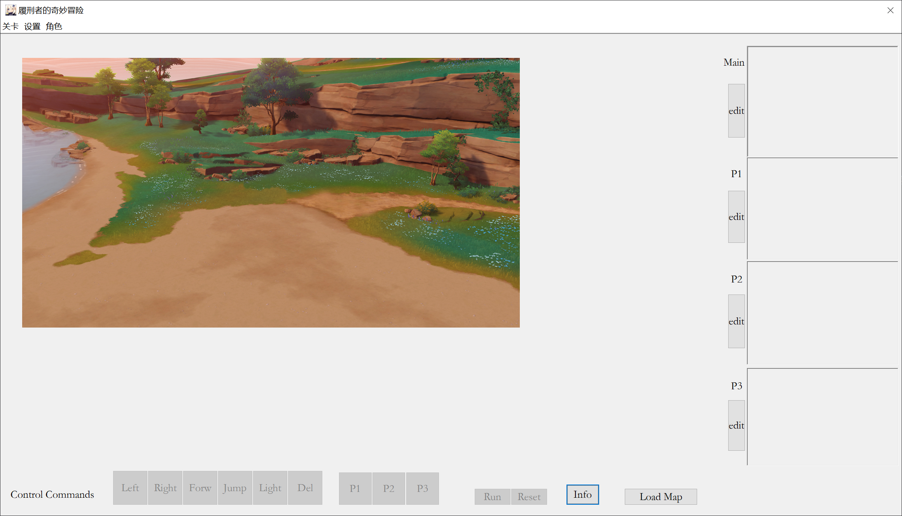

<!--
#参数
同层的：向右下，x+85，y+25
向左下：x-80，y+20
叠层：y-70
-->
## 一、项目背景
旅行者结束了一天的冒险，突然发现尘歌壶里出现了新的地图和锚点。本着不放过视野里任何一个未解锁锚点的原则，旅行者决定解锁新地图上所有未解锁的锚点。但是旅行者的体力条有限，一次只能攀爬一个石头的高度。旅行者想要寻求帮助，但旅行者的向导派蒙和超级大白化漂浮灵一样笨。你能帮帮旅行者吗？
## 二、项目环境
### 主体环境
2022版Visual Studio, 64位 Windows 10操作系统

### 依赖项
Windows.h

stdc++库


## 三、小组成员及项目分工
王思图：绘制模块、显示模块、写文档、过程设计、文件结构设计、教nla MFC和OOP、搭MFC框、联调

聂礼昂：读文件模块、MFC细节完成、交互部分、UI设计

张镕州：执行模块


## 四、程序运行过程
### 1.启动MFC窗口，初始化状态
需要模块：MFC初始化模块

窗口中有info按钮，点击显示游戏背景故事

底下一排有命令输入按钮，点击可输入命令

右侧有三个命令显示区域，分别显示main、P1、P2中的命令

窗口中间显示各种需要显示的图像



### 2.读入地图文件

传入参数：地图文件地址和名称

需要模块：读地图文件模块，参数为地图文件地址和名称，返回值为存有初始地图的map结构体

### 3.展示地图+输入指令
等待输入指令

用户在界面上直接点击按钮输入指令

需要模块：MFC交互界面

返回参数：指令序列
### 4.计算每步状态
根据初始地图和输入指令，计算每执行一个指令后地图和机器人状态

传入参数：存有初始地图的map结构体，指令序列数组

需要的模块：计算模块，参数为存有初始地图的map结构体，指令序列结构体数组，返回值为状态结构体数组，数组每个元素为执行一个指令后的游戏状态结构体，游戏状态结构体应包括机器人状态和地图状态的信息

### 5.根据输出的计算状态绘图
根据过程数组绘制每步的地图

传入参数：游戏状态结构体数组

需要的模块：绘图模块，根据游戏状态结构体绘制每步的情形并存盘

返回值：保存文件的路径数组

传出显示每步状态的bmp文件

### 6.显示状态
在命令行里逐一显示状态图片

需要的模块：显示模块

功能：在MFC窗口里逐张显示状态图片

## 五、公共结构规定

### 位置
```cpp
struct Position {
	int x, y; // x 表示列号，y 表示行号 
};
```
### 机器人
```cpp
struct Robot {
	Position pos; // 机器人位置 
	int direction; // 机器人朝向，1前，2左，3下，4右
};
```

### 单元格
```cpp
struct Cell {
	int height; // 高度 
	bool robot; // true/false分别表示机器人在/不在该单元格上
	int light;//灯状态，0代表没有灯，1代表有灯没点亮，2代表有灯且点亮
};
```
### 一个地图状态
```cpp
struct Map {
	// 单元格组成二维数组，MAX_ROW、MAX_COL为合理常数 
	Cell cells[MAX_ROW][MAX_COL]; 
	// 有效行数、有效列数
	int row, col; 
	//已经点亮的灯数
	int num_lights;
	// 机器人状态
	Robot robot;
};
```
### 指令序列
```cpp
int a[]
//每个数代表一个指令，1左转，2右转，3前进，4跳，5点灯，6函数1，7函数2
```

## 六、代码结构
### MFCapplication2.cpp
包含交互模块全部功能

实现功能为：
* 监测所有按钮点击行为，并将行为转换为命令序列和字符串，字符串将被输出到屏幕上，命令序列将被当做参数，在点击run按钮后被传入到compute
模块中开始执行计算过程
* 按一定速度逐张显示结果图像
* 提供地图文件读入功能
* 提供游戏说明查询功能
* 组合所有模块
* 提供所有整活功能

### defines.h
包含所有的公共变量定义

### draw.h
包含绘制单步状态模块

实现为draw()函数

参数：WritePath(char*), map(Map)

第一个代表存盘路径及文件名

第二个代表某步操作后的map状态

### show.h
包含图片展示模块

参数：ImgPath(char*)

代表要展示的图片的路径及文件名

### draw_all.h
包含绘制多步模块

实现为draw_all()函数

参数：output_path(char*), steps(int), maps(Map*)

第一个代表输出文件夹

第二个代表除初始状态外有多少个需要绘制的地图状态

第三个代表包含所有地图状态的地图结构体数组

### compute.h
包含计算单步模块和多步计算模块

实现为step()函数和excute()函数

后者为主要使用的函数。

传入值为初始地图结构体，三个操作符数组和三个操作符数组长度整数。

传出值为总执行步数。

同时文件中定义了地图结构体数组，用于存储每一步的地图状态。

### run.h
主要封装了拿到所有参数后的计算过程

包含run_draw()函数

传入值为初始地图结构体，所有操作符数组和长度

功能为计算过程中所有地图状态，绘制所有状态，并保存到项目主目录的output文件夹中

## 七、开发日志
### Nov.17
进行项目结构和逻辑的设计

对项目实现进行了拆分

设计了绘图逻辑

### Nov.18
研究了位图文件结构，学习如何在像素层面操作图像，在原神中截取资源图像并抠图，成功利用c++读入图片并保存文件

### Nov.19
研究了windows自带的图形界面接口，尝试了在命令行中输出图像，完成第一版show函数（逐个更改命令行像素的RGB值）

尝试同时读入两张图片并组合

规定了公共数据结构

### Nov.20
尝试同时读入多张图片并组合，并将此功能封装在一个函数中

分割了已写的几个功能，规范了代码结构

### Nov.21
进一步研究了windows自带的图形界面接口，改进了show函数，图形显示速度极大幅度提升

添加draw_all.h头文件，包含draw_all函数，可一次性画完所有步骤并输出为不同名称的文件

开始研究GUI界面，发现微软文档写的像使，未果

晚上发现了MFC这种好东西，和VB完全一样，零学习门槛

根据lightbot原游戏制作了精美界面，学习了button、picture、text等控件的使用，重构了输出模块，肝到熄灯前最后一秒，构建了图形化交互界面，
正式进入GUI时代

今天加入的控件有：

1.Left，Right，Forward，Jump，Light等指令按键，功能为输入指令

2.Delete，Run，Restart等操作按键，功能为修改执行清空指令或输出

3.图片显示控件，用于显示过程

4.Info按键，用于展示游戏背景故事

### Nov.22
nla学习了MFC，发现十分有趣，wst深有同感，于是玩了一天MFC

### Nov.23-Dec.7
疯狂摸鱼，摸摸摸摸摸摸

### Dec.8-Dec.10
主要为nla学习时间。但由于nla没有开发经验以及缺少模块化编程和开发概念，同时比较摆烂，进展颇缓慢。10号上午进行了催交代码、阅读离谱代码、催逼nla读文档、催逼nla改代码
等过程。晚上的时候zrz发来了最终版的计算模块的代码，于是进行了联调。在手动模拟了加载地图文件模块的功能后，联调后的项目成功实现了所有的基础功能。
今天为了代码更加好阅读，将run按钮中的部分代码封装到了run.h头文件中。

### Jan.10-Jan.14
添加了P3；发现windows缩放比例会影响图像显示，添加窗口缩放和按键位置移动绑定；添加了命令限制显示；添加了在run前删除上一次运行生成的图片的功能；移除
了被废弃的选项卡。